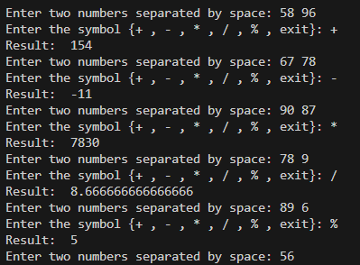

# Python-intership
# Command-Line Calculator (Python)

A simple command-line calculator built using Python and object-oriented programming. Supports basic arithmetic operations.

## Features

- Addition (`+`)
- Subtraction (`-`)
- Multiplication (`*`)
- Division (`/`)
- Remainder (`%`)
- Exit with `exit`

# RESULT

